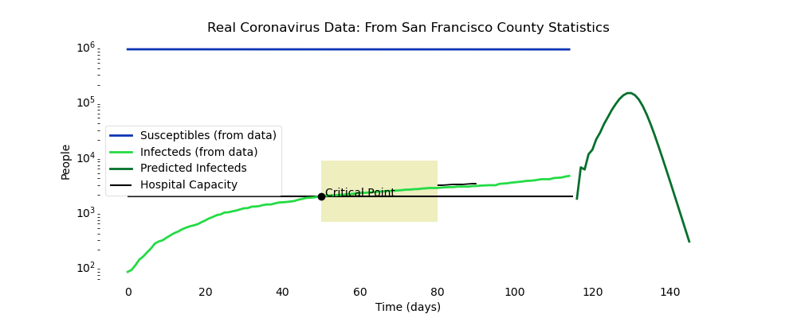
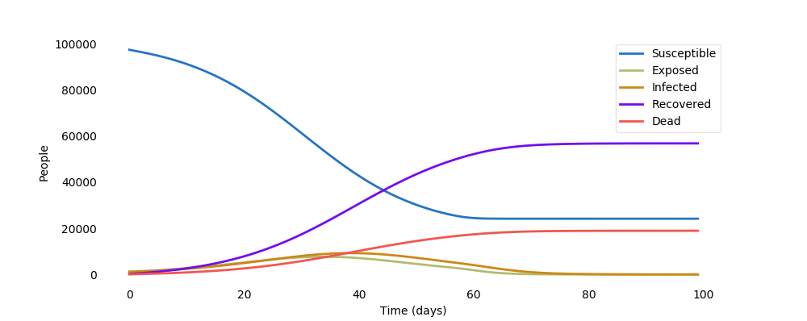

# 

  

A tool for creating and testing epidemiological models faster than ever for the mathematical modeling of infectious 
diseases. An idea from https://github.com/henrifroese/infectious_disease_modelling.

 

## Installation

Install via `pip install epispot`  
As a shorthand, use as `import epispot as epi`

Using Anaconda? Don't worry, it'll soon be avaliable in anaconda!

## Getting Started

Check the guides and tutorials found
in the `tests/tutorials` folder. All tutorials will have a `.md` file
followed by a corresponding code file. If you get stuck, don't understand 
something, or just need to reference the documentation, per-class 
documentation can be found in the `docs/epispot` folder. You may also find 
it helpful to see the examples in the `tests/examples` folder.

## Screenshots

## Features

 - SIR-based models
    - Susceptible
    - Infected
    - Recovered
    - Exposed
    - Dead
    - Critical
    - Hospitalized
    
 - Custom-defined compartmental models
    - Create custom models using the `Model` class
 
 - Graphing Capabilities
    - Plot real data from a `.csv` file
    - Plot model predictions interactively
    - Compare different model predictions

## Compile your model at the speed of light
### and get insights that match
Documentation can easily be accessed from function, class, and file docstrings.
Doc strings provide additional documentation on a certain function.
They can be accessed by the built-in Python `help()` command.
These strings are formatted in Github-flavored markdown.
Additionally, all files will have a 'STRUCTURE' label.
